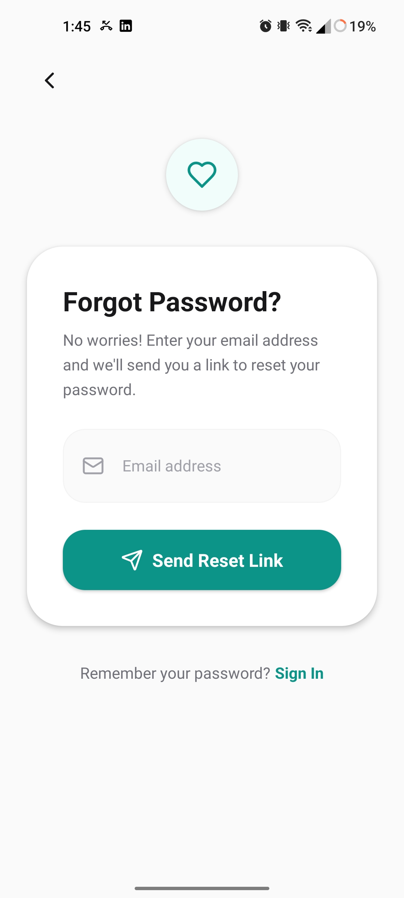
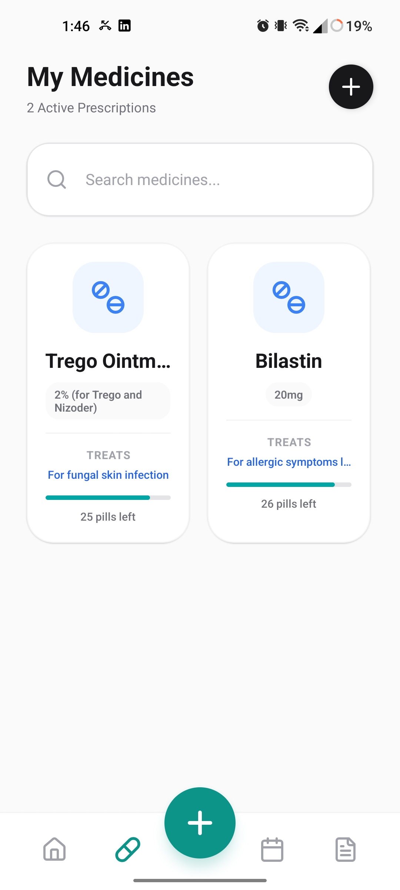
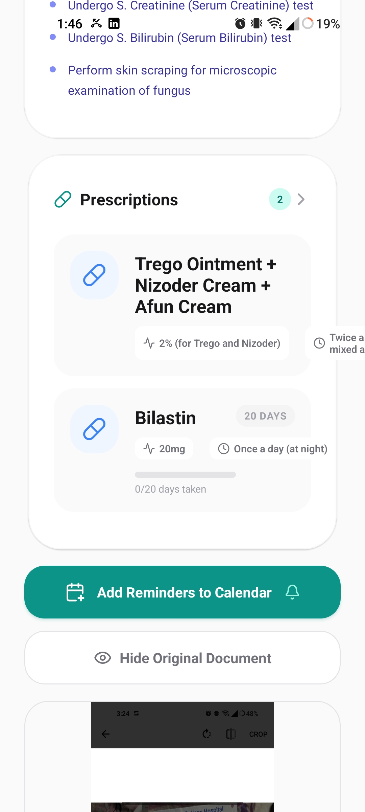

# MedVault AI - Landing Page

<div align="center">
  
  
  **Your Personal Medical Vault, Powered by AI**
  
  [Live Demo](https://medivault-ai-web.vercel.app) | [Features](#features) | [Getting Started](#getting-started)
</div>

---

## 📋 About

MedVault AI is a privacy-first mobile health application that helps users:
- 📄 **Scan & digitize** prescriptions and medical documents
- 💊 **Manage medications** with visual timelines and reminders
- 🔬 **Analyze lab reports** with AI-powered insights
- 🔒 **Securely store** medical history with end-to-end encryption

This repository contains the **landing page** for the MedVault AI application, built with modern web technologies.

---

## ✨ Features

### 🎨 Modern UI/UX
- Stunning 3D animated background using Three.js
- Smooth animations with Framer Motion
- Fully responsive design (mobile, tablet, desktop)
- Dark theme with teal accent colors

### 📱 Feature Gallery
- Interactive showcase of 15+ app screenshots
- Mobile phone frame mockups
- Categorized features (Core, Intelligence, Onboarding)

### 📧 Email Wishlist
- Functional early access signup form
- Email notifications using Formsubmit.co (free, no API keys)
- Error handling and success states

### 🚀 Performance
- Built with Vite for blazing fast development
- Optimized bundle size
- Lazy-loaded images

---

## 🛠️ Tech Stack

| Technology | Purpose |
|------------|---------|
| **React 18** | UI Framework |
| **TypeScript** | Type Safety |
| **Vite** | Build Tool & Dev Server |
| **Three.js** | 3D Graphics |
| **@react-three/fiber** | React renderer for Three.js |
| **@react-three/drei** | Three.js helpers |
| **Framer Motion** | Animations |
| **Tailwind CSS** | Styling (via CDN) |
| **Lucide React** | Icons |
| **Formsubmit.co** | Email Form Backend |

---

## 🚀 Getting Started

### Prerequisites

- Node.js 18+ 
- npm or yarn

### Installation

1. **Clone the repository**
   ```bash
   git clone https://github.com/ankon07/mediVault-AI-Web.git
   cd mediVault-AI-Web
   ```

2. **Install dependencies**
   ```bash
   npm install
   ```

3. **Start development server**
   ```bash
   npm run dev
   ```

4. **Open in browser**
   ```
   http://localhost:3000
   ```

### Build for Production

```bash
npm run build
```

The built files will be in the `dist` directory.

### Preview Production Build

```bash
npm run preview
```

---

## 📁 Project Structure

```
medivault-ai-web/
├── App.tsx                 # Main application component
├── index.tsx               # Entry point
├── index.html              # HTML template
├── index.css               # Global styles
├── constants.ts            # Content configuration
├── types.ts                # TypeScript types
├── vite.config.ts          # Vite configuration
├── tsconfig.json           # TypeScript configuration
├── package.json            # Dependencies
│
├── components/
│   ├── Navigation.tsx      # Header navigation
│   ├── Footer.tsx          # Footer component
│   ├── ThreeBackground.tsx # 3D animated background
│   └── FeaturesGallery.tsx # Feature showcase modal
│
└── images/                 # App screenshots (15 images)
    └── Screenshot_*.jpg
```

---

## 📧 Email Configuration

The wishlist form uses **Formsubmit.co** - a free email service that requires no API keys.

### How it Works:
1. User submits the form
2. Email is sent to `ankonahamed@gmail.com`
3. First submission requires email verification (one-time)

### To Change Recipient Email:
Edit `App.tsx` line 16:
```typescript
const RECIPIENT_EMAIL = 'your-email@example.com';
```

---

## 🚀 Deployment

### Deploy to Vercel (Recommended)

1. Go to [vercel.com/new](https://vercel.com/new)
2. Import your GitHub repository
3. Click **Deploy**
4. Your site will be live at `your-project.vercel.app`

### Deploy to Netlify

1. Go to [app.netlify.com](https://app.netlify.com)
2. Drag and drop the `dist` folder (after running `npm run build`)
3. Or connect your GitHub repo for automatic deploys

### Deploy to GitHub Pages

1. Install gh-pages: `npm install -D gh-pages`
2. Add to package.json scripts:
   ```json
   "predeploy": "npm run build",
   "deploy": "gh-pages -d dist"
   ```
3. Run: `npm run deploy`

---

## 🎨 Customization

### Update Content

All text content is centralized in `constants.ts`:
- Navigation links
- Hero section text
- Feature pillars
- Statistics
- Use cases
- Gallery items
- Footer links

### Update Styling

The project uses Tailwind CSS via CDN. Main color scheme:
- Primary: `teal-500` (#14b8a6)
- Background: `slate-950` (#020617)
- Text: `white` and `slate-400`

### Add/Replace Screenshots

1. Add images to the `images/` folder
2. Update `constants.ts` gallery array:
   ```typescript
   gallery: [
     { 
       title: "Feature Name", 
       description: "Feature description", 
       image: "/images/your-image.jpg", 
       category: "Core" // or "Intelligence", "Onboarding"
     },
     // ...
   ]
   ```

---

## 📱 Screenshots

<div align="center">
  
  
  
  
</div>

---

## 🤝 Contributing

1. Fork the repository
2. Create a feature branch: `git checkout -b feature/new-feature`
3. Commit changes: `git commit -m 'Add new feature'`
4. Push to branch: `git push origin feature/new-feature`
5. Open a Pull Request

---

## 📄 License

This project is licensed under the MIT License.

---

## 👥 Team

**Team MediVault AI**

📧 Contact: ankonahamed@iut-dhaka.edu

---

<div align="center">
  Made with ❤️ by Team MediVault AI
</div>
